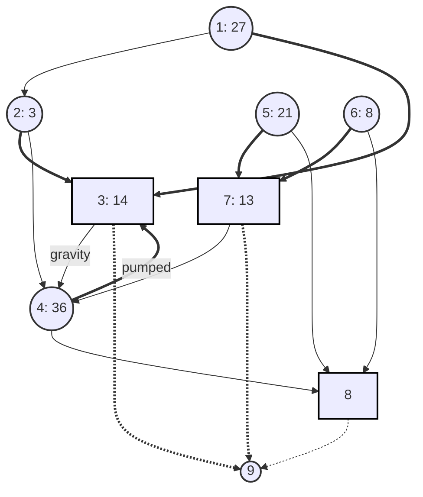
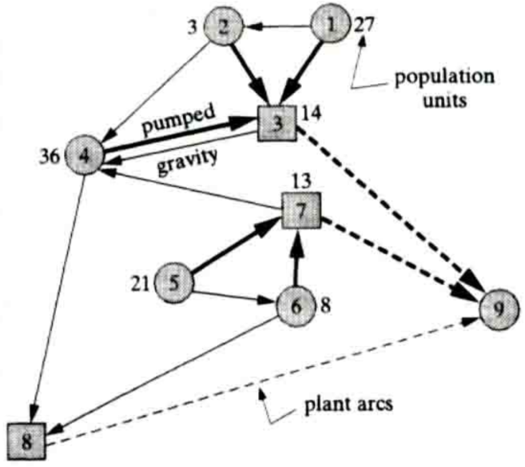

# Requirements

1. System model
2. Solving the Model Using the Appropriate Tool (Python, CPLEX, AMPL, etc)

# Problem Statement

Network design applications may involve telecommunications, electricity, water,
gas, coal slurry, or any other substance that flows in a network. We illustrate
with an application involving regional wastewater (sewer) networks.

As new areas develop around major cities, entire networks of collector sewers
and treatment plants must be constructed to service growing population. Figure
displays our particular (fictional) instance.

| Arc   | Fixed Cost | Variable Cost |
| ----- | ---------- | ------------- |
| (1,2) | 240        | 21            |
| (1,3) | 350        | 30            |
| (2,3) | 200        | 22            |
| (2,4) | 750        | 58            |
| (3,4) | 610        | 43            |
| (3,9) | 3800       | 1             |
| (4,3) | 1840       | 49            |
| (4,8) | 780        | 63            |
| (5,6) | 620        | 44            |
| (5,7) | 800        | 51            |
| (6,7) | 500        | 56            |
| (6,8) | 630        | 94            |
| (7,4) | 1120       | 82            |
| (7,9) | 3800       | 1             |
| (8,9) | 2500       | 2             |

Nodes 1 to 8 of the network represent population centers where smaller sewers
feed into the main regional network, and locations where treatment plants might
be built. Wastewater loads are roughly proportional to population; therefore,
the inflows indicated at nodes represent population units in thousands.

Arcs connecting nodes 1 to 8 indicate possible routes for the main collector
sewers. Most follow the topology in gravity flow, but one pumped line (4, 3) is
included. A large part of the construction cost for either type of line is
fixed: right-of-way acquisition, trenching, and so on. Still, the cost of a
line also grows with the number of population units carried, because greater
lows imply larger-diameter pipes. The table in Figure shows the fixed and
variable cost for each arc in thousand of dollars. Treatment plant costs occur
at nodes—here nodes 3, 7, and 8. Figure illustrates, however, that such costs
can be modeled on arcs by introducing an artificial "supersink" node 9. Costs
shown for arcs (3,9), (7,9), and (8,9) capture the fixed and variable expense
of plant construction as flows depart the network. Derive a model the
wastewater system design problem of Figure as the fixed-charge network flow
problem.
